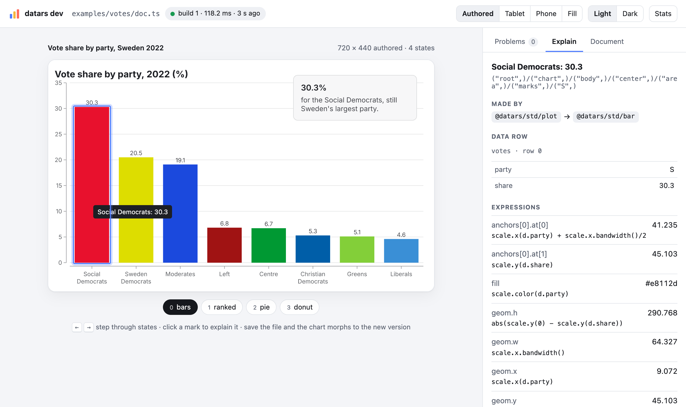
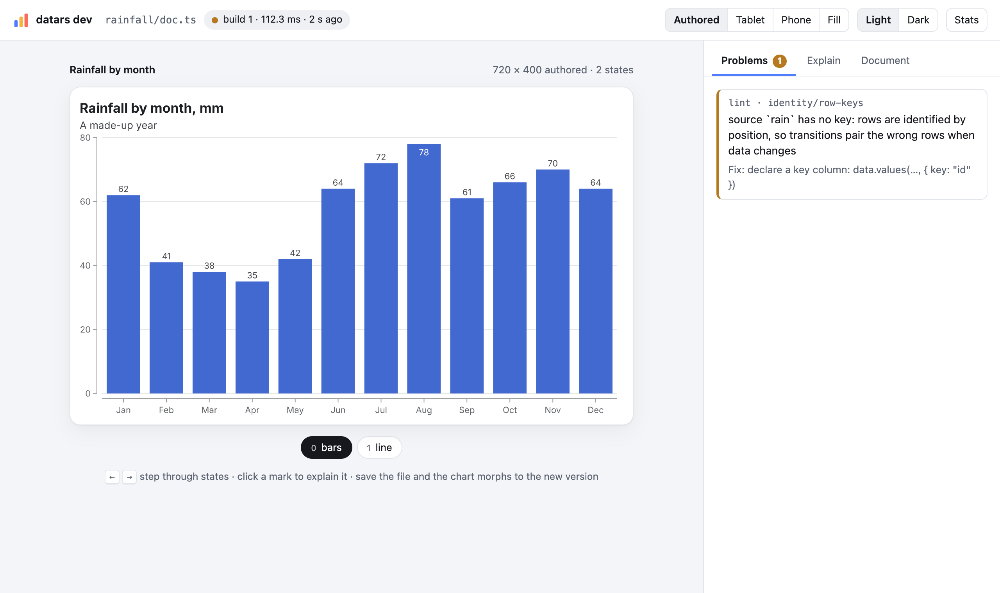
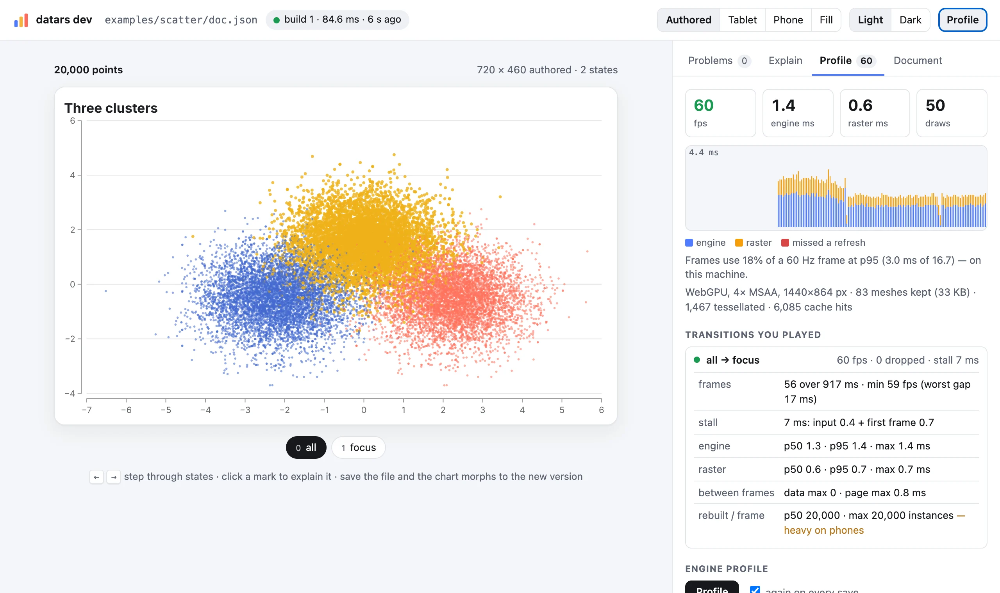

# datars

**Data graphics that move, on every platform, from one engine.** datars is a deterministic Rust engine
for charts, maps and data stories. You write a chart as a small TypeScript document; the engine lays
it out, animates it and draws it the same way on the web, in iOS, Android and desktop apps, in video
and in PNG, SVG or PDF. You publish it as a small bundle that apps and pages load at runtime, so
updating a chart doesn't need an app release or a site deploy.

[Documentation](site/docs/index.md) · [Getting started](site/docs/getting-started.md) ·
[Chart reference](docs/reference/std.md) · [How it works](docs/README.md) ·
[Status](docs/19-status.md) · [Contributing](CONTRIBUTING.md)



<sub>`datars dev`: the chart live, its states under it, and — for the bar you clicked — the recipes
that made it, its data row and every expression's value.</sub>

## A chart is a small program

```ts
import { doc, data, e, group, signal, story, step } from "@datars/sdk";
import { plot, bar, pie } from "@datars/std";

export default doc({
  title: "Vote share",
  size: [720, 440],
  data: { votes: data.values({ party: ["S", "SD", "M"], share: [30.3, 20.5, 19.1] }, { key: "party" }) },
  signals: { shape: signal.str("bars") },
  scene: group({ key: "root", children: [
    plot({ data: "votes", x: "party", y: "share", color: "party", children: [bar({ labels: true })] }, { key: "chart", when: e('shape == "bars"') }),
    pie({ data: "votes", value: "share", category: "party" }, { key: "chart", when: e('shape == "pie"') }),
  ] }),
  program: story({ steps: [step("bars", { set: { shape: "bars" } }), step("pie", { set: { shape: "pie" } })] }),
});
```

Each party is keyed, so stepping from `bars` to `pie` morphs every bar into its own slice. `plot`, `bar`
and `pie` are **recipes** from the standard library (about 60 of them: bars, lines, areas, maps,
sankeys, candlesticks, sliders, axes, legends…), written in TypeScript against the same public SDK you
use. You can eject any of them into your project and change it (`datars eject std/bar`).

## The dev loop

```sh
datars dev chart/doc.ts
```

opens a live page. Save the file and the chart **morphs to the new version** from whatever is on
screen, with no reload and no lost state. Around the chart:

- **States** — step through the program with the pills or the arrow keys.
- **Preview sizes and modes** — authored size, tablet, phone or full width (charts lay themselves out
  again, they don't scale), light and dark.
- **Problems** — `check` diagnostics and `lint` findings, each with a fix: missing keys, encodings that
  mislead, labels too small or overlapping, contrast, theme misuse.
- **Explain** — click any mark to see why it looks the way it does: the recipes that made it, its data
  row and every expression's value.
- **Profile** — live frame times (engine and raster, dropped frames), every transition you play scored
  with its stall and slowest frame, and the engine's own profile of every state and transition at
  60 fps — re-run on every save, so you see what an edit costs.
- **Maps** — automatic basemaps are cut for the document's own camera views, shown at once and filled
  in with streets as the data arrives.

| Problems, with fixes | Profile: frames, drops, what each transition cost |
|---|---|
|  |  |

Everything the page shows is also a command, so it works in a terminal, in CI and for coding agents
(the same tools are served over MCP by `datars-mcp`):

```sh
datars check   doc.ts                  # diagnostics
datars lint    doc.ts                  # identity, encoding, legibility, accessibility, theme
datars render  doc.ts --state pie      # PNG from the CPU reference renderer: identical on every machine
datars film    doc.ts --from 0 --to 1  # a filmstrip and motion trails of a transition
datars explain doc.ts --key '("S",)'   # why an element looks the way it does
datars profile doc.ts                  # every state and transition timed: resolve, frames, GPU raster
datars test                            # goldens: every state, 64 samples of every transition, motion checks
```

```text
$ datars profile examples/votes/doc.json
                                cold ms    warm ms    flatten     cpu px
state bars                         1.04       0.01       0.01       9.67   (91 nodes, 63 ops)
state ranked                       0.97       0.01       0.01       9.62   (90 nodes, 62 ops)
…
transitions (stepped at 60 fps, gpu raster, dpr 2):
bars → ranked   56 frames   stall 2 ms (input 0 + first frame 2: 1 meshes tessellated; unprepared input 2)   frames p50 0.6 p95 1.1 max 2.2 ms   0 over 16.7, 0 dropped
    ▂▁▁▁▁▁▁▁▁▁▁▁▁▂▁▂▁▁▁▁▁▁▁▁▁▁▁▁▁▁▁▁▁▁▁▁▁▁▁▁▁▁▁▁▁▁▁▁▁▁▁▁▁▁▁▁
    engine p50 0.1 p95 0.1 · gpu p50 0.6 p95 1.0 ms (cpu side p50 0.2: tessellate, upload, encode) · 154 draws, 10 tessellated, 0 instances rebuilt per frame (p50; max 0)
…
```

More: `datars data profile data.csv` (types, gaps, candidate keys before you chart),
`datars new mychart --template story|chart|explorable|map`, `datars describe std/bar`,
`datars diff doc.ts --states bars,pie`, `datars semantics doc.ts` (what a screen reader gets). The
[tools guide](site/docs/tools.md) covers them all.

## Ship it

```sh
datars publish doc.ts --alias votes --to site/     # static files: site/c/votes + content-addressed chunks
datars serve site/                                 # try it locally
```

```html
<script type="module" src="/runtime/datars.js"></script>
<datars-view src="/c/votes"></datars-view>
```

In apps: `DatarsChart(source: .url(…))` in SwiftUI, `DatarsView.load(url)` on Android, or the React
component from `@datars/react`. A bundle always carries a poster and accessible text, then the least
the device needs to play it: baked scenes, a pre-expanded document, or the source. Republishing
updates every embed; an older runtime plays the variant it supports, or falls back to the poster.

## What's verified

All of this is checked in this repository ([status and evidence](docs/19-status.md)):

- **The same pixels everywhere.** Every example state hashes identically on macOS arm64 and x86_64, in
  wasm, in the iOS simulator and on an Android emulator. The GPU backend matches the CPU reference
  perceptually, and recorded interactive sessions replay bit-exactly.
- **Smooth motion.** Every transition of every example is swept at 64 samples and checked for flashes,
  blinks, pops and exact endpoints; the heavy charts (3,100 counties, 20,000 moving points, 4 million
  points with level of detail, street-level map flights) step at 60 fps without dropped frames on a
  desktop GPU ([performance](docs/19-status.md#performance)).
- **Charts are content.** A chart published after the web page, the SwiftUI app and the Android app
  were built plays in all of them, and a republish updates them.
- **Accessible by default.** Charts carry a semantics tree: an ARIA mirror on the web, VoiceOver on
  iOS, TalkBack on Android, AccessKit on the desktop; engine-drawn sliders become native controls;
  reduced motion is respected everywhere.

## Build from source

You need [Rust](https://rustup.rs) (stable), [Node](https://nodejs.org) 20+ and
[pnpm](https://pnpm.io). [CONTRIBUTING.md](CONTRIBUTING.md) has the full list, including the optional
toolchains for the web runtime, Apple and Android.

```sh
cargo build --release -p datars-cli            # the `datars` command (target/release/datars)
pnpm install && bash scripts/build-js.sh       # @datars/sdk and @datars/std, built into the engine
target/release/datars dev examples/votes/doc.ts
cargo test --workspace && target/release/datars test
```

The web runtime is WebAssembly: `bash scripts/build-wasm.sh && pnpm -C packages/web build` (the script
lists its one-time setup). Apple: `scripts/build-apple.sh`; Android: `scripts/build-android.sh`. The
website, with every chart live: `node scripts/build-site.mjs && target/release/datars serve out/pages`.

## Repository

| Path | What |
|---|---|
| `crates/datars-{math,color,theme,scene,text,data,expr,algo,layout,graph,motion,geo,ir}` | the engine's layers — deterministic, sans-IO |
| `crates/datars-engine` | documents → tables → scenes → transitions → frames: the host contract |
| `crates/datars-render-{cpu,svg,pdf,wgpu}` | backends: the bit-exact CPU reference, SVG, PDF, the GPU (WebGPU, WebGL2, Metal, Vulkan, GLES, DX12) |
| `crates/datars-sandbox` | QuickJS with deterministic `Math`, for recipes |
| `crates/datars-bundle`, `datars-build` | the bundle format and loader; the publish compiler |
| `crates/datars-runtime`, `datars-host-{web,native}`, `datars-ffi` | the installed runtime and its hosts; the C ABI for Swift and Kotlin |
| `crates/datars-{cli,devtools,test,headless,mcp}` | the `datars` command, lint and explain, the golden tests, headless rendering, the MCP server |
| `crates/datars-geo-build` | OpenStreetMap and Natural Earth → vector tiles and atlases |
| `packages/{sdk,std,web,react,vite,next,compile,python}` | `@datars/sdk`, `@datars/std`, `<datars-view>`, the React, Vite and Next.js integrations, notebooks |
| `apple/DatarsKit`, `android/` | the Swift package (iOS, macOS) and the Android library |
| `examples/` | example documents — each is also a golden test |
| `site/` | the website: docs, gallery, articles, all charts live |
| `docs/` | how it works and why: the design documents |

## Community

Questions and ideas: GitHub Discussions. Bugs: issues (a small document that
reproduces it helps most). Pull requests aren't accepted while the code is proprietary
([CONTRIBUTING.md](CONTRIBUTING.md)). Security reports: see [SECURITY.md](SECURITY.md). Everyone
taking part follows the [code of conduct](CODE_OF_CONDUCT.md).

## License

Proprietary for now: © 2026 Jakob Råhlén, all rights reserved ([LICENSE](LICENSE)). The source is
published to be read; using, copying or distributing it needs written permission.
Third-party material (fonts, map data, ported algorithms) is listed in
[THIRD_PARTY_NOTICES.md](THIRD_PARTY_NOTICES.md).
